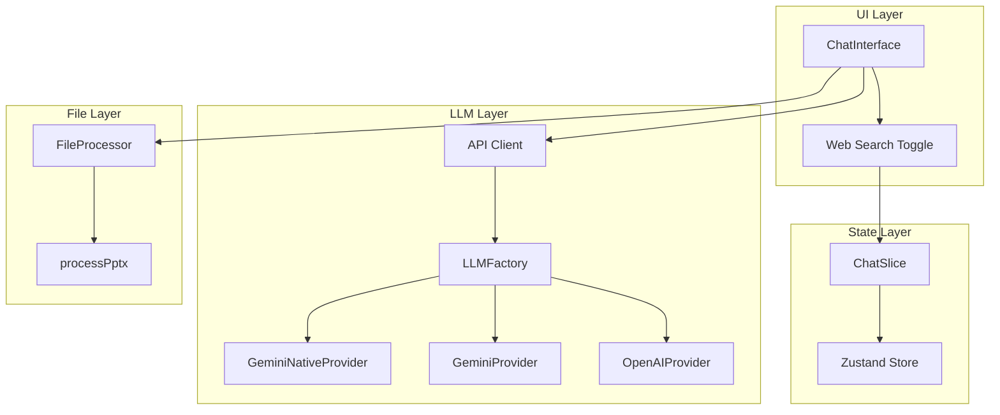

# Design Document: ChatVIP Upgrade

## Overview

本设计文档描述 ChatVIP 升级的技术实现方案，包含三个核心功能模块：

1. **PPTX 文件解析** - 使用 JSZip 解析 PowerPoint 文件
2. **Gemini 原生协议 Provider** - 直接调用 Google generativelanguage API
3. **联网搜索功能** - 通过 UI 开关控制 LLM 的网络搜索能力

## Architecture



## Components and Interfaces

### 1. File Processor - PPTX Support

**文件**: `lib/file-processor.ts`

新增 `processPptx` 函数，使用 JSZip 解析 PPTX 文件：

```typescript
import JSZip from 'jszip';

async function processPptx(buffer: ArrayBuffer): Promise<string> {
  const zip = await JSZip.loadAsync(buffer);
  let fullText = '';

  // 获取所有幻灯片文件
  const slideFiles = Object.keys(zip.files).filter(fileName => 
    fileName.match(/^ppt\/slides\/slide\d+\.xml$/)
  );

  // 按数字顺序排序
  slideFiles.sort((a, b) => {
    const numA = parseInt(a.match(/\d+/)![0]);
    const numB = parseInt(b.match(/\d+/)![0]);
    return numA - numB;
  });

  for (const fileName of slideFiles) {
    const content = await zip.files[fileName].async('string');
    // 简单 XML 解析：移除标签，保留文本
    const text = content.replace(/<[^>]+>/g, ' ').replace(/\s+/g, ' ').trim();
    if (text) {
      const slideNum = fileName.match(/\d+/)![0];
      fullText += `--- Slide ${slideNum} ---\n${text}\n\n`;
    }
  }

  return fullText || "[PPTX 解析完成，但未提取到文本，可能是纯图片幻灯片]";
}
```

**集成点**: 在 `processFile` 函数中添加 PPTX 分支：

```typescript
} else if (name.endsWith('.pptx') || name.endsWith('.ppt')) {
    extractedText = await processPptx(buffer);
}
```

### 2. Store - Web Search State

**文件**: `store/slices/createChatSlice.ts`

扩展 ChatSlice 接口：

```typescript
export interface ChatSlice {
  // ... existing fields
  isWebSearchEnabled: boolean;
  toggleWebSearch: () => void;
}

export const createChatSlice: StateCreator<ChatSlice> = (set) => ({
  // ... existing state
  isWebSearchEnabled: false,
  toggleWebSearch: () => set((state) => ({ 
    isWebSearchEnabled: !state.isWebSearchEnabled 
  })),
});
```

### 3. GeminiNativeProvider

**新文件**: `lib/llm/providers/GeminiNativeProvider.ts`

实现 Google 原生 API 协议的 Provider：

```typescript
export class GeminiNativeProvider extends BaseProvider {
  readonly name = 'GeminiNative';

  supportsModel(modelId: string): boolean {
    return ['gemini-3-pro-preview-v', 'gemini-3-flash-preview-v'].includes(modelId);
  }

  async streamChat(options: ChatOptions): Promise<void> {
    const { apiKey, model, messages, onChunk, onComplete, onError, isWebSearchEnabled } = options;
    
    // 转换消息格式为 Gemini contents
    const contents = this.convertToGeminiFormat(messages);
    
    // 构造请求体
    const body: GeminiRequestBody = {
      contents,
      generationConfig: { temperature: 0.7 }
    };
    
    // 联网搜索
    if (isWebSearchEnabled) {
      body.tools = [{ googleSearch: {} }];
    }
    
    // 发送请求到 Google API
    const url = `https://generativelanguage.googleapis.com/v1beta/models/${model}:streamGenerateContent?key=${apiKey}&alt=sse`;
    
    // ... SSE 流处理
  }
  
  private convertToGeminiFormat(messages: Message[]): GeminiContent[] {
    return messages.map(msg => ({
      role: msg.role === 'user' ? 'user' : 'model',
      parts: [{ text: msg.content }]
    }));
  }
}
```

**Gemini API 格式**:

```typescript
interface GeminiContent {
  role: 'user' | 'model';
  parts: Array<{ text: string }>;
}

interface GeminiRequestBody {
  contents: GeminiContent[];
  generationConfig?: { temperature?: number };
  tools?: Array<{ googleSearch: {} }>;
}
```

### 4. OpenAI Provider - Web Search Support

**文件**: `lib/llm/providers/OpenAIProvider.ts`

修改 `streamChat` 方法支持联网：

```typescript
async streamChat(options: ChatOptions): Promise<void> {
  // ... existing code
  
  const requestBody: any = {
    model,
    messages: apiMessages,
    stream: true,
    // ...
  };

  if (options.isWebSearchEnabled) {
    requestBody.tools = [{
      type: 'function',
      function: {
        name: 'google_search',
        description: 'Search the web for real-time information',
        parameters: { 
          type: 'object', 
          properties: { query: { type: 'string' } } 
        }
      }
    }];
  }
  
  // ... rest of implementation
}
```

### 5. LLM Factory Update

**文件**: `lib/llm/LLMFactory.ts`

更新 provider 注册顺序：

```typescript
import { GeminiNativeProvider } from './providers/GeminiNativeProvider';

const providers: ILLMProvider[] = [
  new GeminiNativeProvider(),  // 优先匹配 -v 模型
  new GeminiProvider(),
  new OpenAIProvider(),
];
```

### 6. ChatOptions Type Update

**文件**: `lib/llm/types.ts`

扩展 ChatOptions 接口：

```typescript
export interface ChatOptions {
  // ... existing fields
  isWebSearchEnabled?: boolean;
}
```

### 7. API Client Update

**文件**: `lib/api-client.ts`

更新函数签名：

```typescript
export async function streamChatCompletion(
  apiKey: string,
  model: ModelId,
  messages: Message[],
  attachments: Attachment[],
  userSystemPrompt: string,
  signal: AbortSignal,
  onChunk: (chunk: string) => void,
  onComplete: (usage?: UsageStats) => void,
  onError: (err: Error) => void,
  isWebSearchEnabled: boolean = false  // 新增参数
): Promise<void> {
  const provider = LLMFactory.getProvider(model);
  
  return provider.streamChat({
    apiKey,
    model,
    messages,
    attachments,
    userSystemPrompt,
    signal,
    onChunk,
    onComplete,
    onError,
    isWebSearchEnabled,
  });
}
```

### 8. ChatInterface UI Update

**文件**: `components/ChatInterface.tsx`

替换 Terminal 按钮为 Globe 按钮：

```tsx
import { Globe } from 'lucide-react';

// 获取状态
const { isWebSearchEnabled, toggleWebSearch } = useStore();

// 替换按钮
<button 
  onClick={(e) => { e.stopPropagation(); toggleWebSearch(); }} 
  className={`p-2 md:p-3 rounded-full transition-colors shrink-0 ${
    isWebSearchEnabled 
      ? 'text-blue-500 bg-blue-500/10' 
      : 'text-muted-foreground hover:text-foreground hover:bg-muted/50'
  }`} 
  title={isWebSearchEnabled ? "已开启联网搜索" : "点击开启联网搜索"}
>
  <Globe size={16} className="md:w-[18px] md:h-[18px]" />
</button>
```

## Data Models

### Gemini Native API Types

```typescript
// Request types
interface GeminiContent {
  role: 'user' | 'model';
  parts: GeminiPart[];
}

interface GeminiPart {
  text?: string;
  inlineData?: {
    mimeType: string;
    data: string;
  };
}

interface GeminiTool {
  googleSearch?: {};
}

interface GeminiRequestBody {
  contents: GeminiContent[];
  generationConfig?: {
    temperature?: number;
    maxOutputTokens?: number;
  };
  tools?: GeminiTool[];
}

// Response types (SSE)
interface GeminiStreamResponse {
  candidates?: Array<{
    content?: {
      parts?: Array<{ text?: string }>;
    };
  }>;
}
```

## Correctness Properties

*A property is a characteristic or behavior that should hold true across all valid executions of a system—essentially, a formal statement about what the system should do. Properties serve as the bridge between human-readable specifications and machine-verifiable correctness guarantees.*

### Property 1: PPTX Slide Order Preservation

*For any* valid PPTX file containing multiple slides, when processed by processPptx, the extracted text SHALL appear in the same order as the original slides (slide1 before slide2, etc.).

**Validates: Requirements 1.1, 1.3**

### Property 2: Web Search State Toggle

*For any* initial state of isWebSearchEnabled, calling toggleWebSearch SHALL result in the opposite boolean value.

**Validates: Requirements 2.2**

### Property 3: GeminiNative Model Matching

*For any* model ID string, GeminiNativeProvider.supportsModel SHALL return true if and only if the model ID is exactly "gemini-3-pro-preview-v" or "gemini-3-flash-preview-v".

**Validates: Requirements 3.1**

### Property 4: Gemini Message Format Conversion

*For any* array of Message objects, convertToGeminiFormat SHALL produce an array of GeminiContent objects where each user message has role 'user' and each assistant message has role 'model'.

**Validates: Requirements 3.4**

### Property 5: Web Search Tool Inclusion (GeminiNative)

*For any* request where isWebSearchEnabled is true, the GeminiNativeProvider request body SHALL contain a tools array with googleSearch object.

**Validates: Requirements 3.3**

### Property 6: Web Search Tool Inclusion (OpenAI)

*For any* request where isWebSearchEnabled is true, the OpenAIProvider request body SHALL contain a tools array with google_search function definition.

**Validates: Requirements 4.1**

### Property 7: LLM Factory Routing

*For any* model ID containing "-v" suffix (gemini-*-v), LLMFactory.getProvider SHALL return an instance of GeminiNativeProvider. For other Gemini models, it SHALL return GeminiProvider.

**Validates: Requirements 5.1, 5.2**

## Error Handling

### File Processing Errors

| Error Condition | Handling |
|----------------|----------|
| Invalid PPTX (not a zip) | Throw Error with "文件解析失败: 无效的 PPTX 格式" |
| Empty PPTX (no slides) | Return descriptive message about no text extracted |
| Corrupted slide XML | Skip slide, continue processing others |

### API Errors

| Error Condition | Handling |
|----------------|----------|
| Invalid API Key | Throw Error with "API Key 无效或未授权" |
| Network timeout | Retry up to 2 times with exponential backoff |
| Gemini API error | Call onError callback with parsed error message |

## Testing Strategy

### Unit Tests

- Test processPptx with mock PPTX buffers
- Test Store toggleWebSearch action
- Test GeminiNativeProvider.supportsModel with various model IDs
- Test message format conversion

### Property-Based Tests

使用 **fast-check** 作为 TypeScript 的属性测试库。

每个属性测试应运行至少 100 次迭代，并使用以下标签格式：
```
**Feature: chatvip-upgrade, Property {number}: {property_text}**
```

**测试配置**:
```typescript
import fc from 'fast-check';

// 每个属性测试至少 100 次
fc.assert(
  fc.property(/* arbitraries */, (input) => {
    // property assertion
  }),
  { numRuns: 100 }
);
```

### Integration Tests

- Test full flow: upload PPTX → extract text → send to LLM
- Test web search toggle → API request includes tools
- Test model routing through LLMFactory
